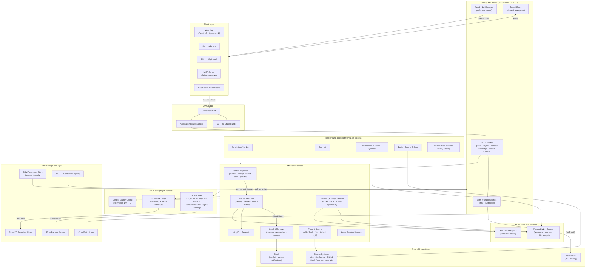

# PIM Target Architecture Capability Requirements

Status: draft for ops architecture discussion  
Last reviewed: 2026-06-10  
Audience: infrastructure, operations, platform, security, and PIM engineering

## Purpose
PIM is the Pod Intelligence Manager: a coordination layer for AI and human teams working in sprint pods and long-lived projects. It accepts structured updates from humans and agents, classifies and merges context, detects conflicts, maintains generated living docs, exposes live pod/project status in a web UI, and builds persistent organizational memory from completed work.

## Architecture Diagram

## Product Surfaces

PIM currently has these user and agent entry points:

| Surface | What users do there | Current implementation |
|---|---|---|
| Web app | Manage orgs, pods, projects, conflicts, living docs, tunnels, knowledge graph, context search, and member settings. | React 19 + Vite + Spectrum 2 SPA in `packages/ui`; hosted from static object storage behind a CDN in the AWS MVP. |
| HTTP API | Create pods/projects, submit updates, resolve conflicts, query knowledge, search context, manage membership, and support UI/CLI/MCP. | Fastify server in `packages/server`, currently one Node 22 container. |
| Realtime channel | Push pod changes, conflict changes, living doc updates, tunnel state, queue drains, knowledge updates, and quality score revisions. | Native WebSocket support in the Fastify server via `@fastify/websocket`; in-memory connection registry. |
| CLI | Login, create/list/archive pods, bind a repo, submit reports, fetch context, manage tunnels, run search, and install git hooks. | `ado-pim` package in `packages/cli`; global install from Artifactory or local workspace. |
| SDK | Let agents submit updates and pull compact session context programmatically. | `@pim/sdk` in `packages/sdk`. |
| MCP server | Let Claude Desktop/Code interact with PIM tools and render pod dashboards. | `@pim/mcp-server`, installed globally or run from the repo; calls the same HTTP API. |
| Dev tunnels | Expose a developer's local app to reviewers through a share URL and tunnel dashboard. | CLI opens an outbound WebSocket to the server; server proxies `/tunnel/...` requests through an in-process tunnel map. |

## Current Stack Snapshot

The current AWS MVP is optimized for speed of delivery, not high availability.

| Concern | Current implementation |
|---|---|
| Server runtime | One Node 22 container on one EC2 instance managed by an Auto Scaling Group with desired/min/max set to 1. |
| UI hosting | Static UI bundle in S3, served through CloudFront. |
| API routing | CloudFront routes API/WebSocket traffic to an ALB, then to the EC2-hosted container on port 4000. |
| Database | SQLite via Node's built-in `node:sqlite` `DatabaseSync`; WAL mode, foreign keys, and a 5-second busy timeout. DB file is mounted at `/data/pim.db`. |
| Persistent volume | Encrypted EBS volume mounted at `/data`. |
| Knowledge graph storage | In-memory graph hydrated from local JSON files under `/data/knowledge-graph`; writes mirrored to S3 when `KG_S3_BUCKET` is set. |
| Backups | Hourly SQLite `.dump` from a cron job inside the running container, uploaded to an S3 backups bucket and retained by lifecycle rules. |
| Container image | Server image stored in ECR; EC2 systemd unit pulls and runs `latest`. |
| Secrets/config | SSM Parameter Store path `/pim/*` loaded into env vars by the container entrypoint. |
| Logs | Container logs sent to CloudWatch Logs with one-month retention. |
| LLM and embeddings | Bedrock runtime called by bearer token env var; Claude Haiku/Sonnet for reasoning, Titan Text Embeddings v2 for vectors. |
| Auth | Server supports `trust` mode for local/dev and `ims` mode using Adobe IMS JWT verification. Actual deployment mode is controlled by env. |
| Background jobs | `setInterval` loops inside the single server process for escalation, lint, graph refresh, pruning, and synthesis. |
| Current limits | Single instance, no zero-downtime deploys, in-process WebSocket/tunnel state, synchronous SQLite call sites, and no distributed job ownership. |

## Capability Requirements

### 1. Identity, Organizations, and Access Control

What PIM needs:

- Verify human identity for browser, CLI, SDK, and MCP clients.
- Maintain users, orgs, org memberships, roles, and pending invites.
- Support user-level routes that do not require a selected org and org-scoped routes that must never leak data across orgs.
- Enforce membership and role checks for creating orgs, inviting members, updating roles, removing members, and accepting invites.
- Carry org selection consistently through web, CLI, SDK, and MCP calls.
- Keep local development usable without enterprise login while keeping hosted deployments enforceable.

Current implementation:

- Adobe IMS JWT verification in `ims` mode; local `trust` mode upserts a dev user.
- `X-Pim-Org` header selects the org for scoped routes.
- SQLite tables: `users`, `orgs`, `memberships`, `org_invites`.
- Org/member routes are in `packages/server/src/routes/orgs.ts`.
- UI auth/org context injects bearer token and org slug into API calls.

Target architecture implications:

- Provide a reliable identity validation path for browser and non-browser clients.
- Preserve org-scoped authorization at the API boundary and data-access layer.
- Support secure storage of client IDs, token settings, and integration credentials.
- Provide auditable records for membership, invite, role, and access-sensitive changes.

### 2. Web Application Delivery

What PIM needs:

- Serve a static single-page app with client-side routing.
- Route `/api`, `/ws`, `/tunnel`, and SPA page paths correctly from one public origin.
- Avoid stale UI after deploys while keeping static asset delivery fast.
- Support environment-specific auth mode and API configuration.

Current implementation:

- Vite builds the SPA.
- Static assets are uploaded to an S3 UI bucket.
- CloudFront serves the UI and forwards API/WebSocket/tunnel paths to the server origin.
- The UI uses routes for `/org`, `/org/members`, `/knowledge`, `/search`, `/project/:projectId`, and `/pod/:podId`.

Target architecture implications:

- Static app delivery should support cache invalidation or immutable asset naming.
- API and WebSocket routes need predictable path routing from the same front door.
- The target must support HTTPS and browser WebSocket upgrades.

### 3. Core API Runtime

What PIM needs:

- Run a TypeScript/Node HTTP API with long-lived WebSocket support.
- Handle request validation, auth hooks, org resolution, rate limiting, CORS, and structured errors.
- Serve both human UI workflows and machine clients with the same API contract.
- Continue gracefully under partial downstream failures such as unavailable LLMs, missing source credentials, or failed Slack notifications.
- Shut down cleanly so database writes and WebSocket/tunnel clients are not corrupted.

Current implementation:

- Fastify server in `packages/server/src/index.ts`.
- `@fastify/rate-limit` global limit is 100 requests/minute, with stricter limits on some routes.
- `@fastify/cors` allows the configured UI origin.
- Server process starts all routes and periodic jobs.

Target architecture implications:

- The runtime should support horizontal scale for stateless HTTP routes.
- Any process-local state today must be externalized, made sticky, or deliberately isolated to one worker role.
- Graceful shutdown, health checks, and deploy draining are required.

### 4. Transactional State

What PIM needs:

- Store relational state for orgs, projects, pods, pod areas, context updates, conflicts, living docs, tunnels, graph metadata, agent memory, source evidence, and queues.
- Enforce tenant isolation on reads/writes.
- Support transactions for archive/delete/promote workflows.
- Support indexes for org, project, pod, timestamp, status, and source lookups.
- Handle concurrent context submissions without data loss.
- Support schema migration without manual DB edits.

Current implementation:

- SQLite file at `DB_PATH`, using synchronous `node:sqlite` calls.
- WAL mode, foreign keys, and `busy_timeout = 5000`.
- Schema is created and patched imperatively in `packages/server/src/db/schema.ts`.
- Many server files call `db.prepare(...)` directly.

Target architecture implications:

- Ops should plan for a durable transactional store with concurrency, backups, point-in-time recovery, and migration support.
- Engineering needs a repository/data-access layer before moving away from SQLite because direct sync calls are spread through the server.
- The target must preserve SQL-like query patterns or provide an equivalent migration path for joins, indexes, and transactions.

### 5. Pod Lifecycle and Sprint Coordination

What PIM needs:

- Create, view, update, and archive sprint pods.
- Link pods to long-lived projects.
- Track sprint day, total days, active milestone, milestone percent complete, scope areas, owners, and statuses.
- Recompute pod snapshots from incoming updates.
- Show org-level active pod summaries, archived pods, and cross-pod overlaps.

Current implementation:

- Pod and org routes in `packages/server/src/routes/pods.ts` and `packages/server/src/routes/org.ts`.
- SQLite tables: `pods`, `pod_areas`, `org_pod_summaries`, `archived_pods`, `cross_pod_overlaps`.
- Snapshot refresh is deterministic in `packages/server/src/services/pod-snapshot.ts`.
- UI views include Org Dashboard and Pod Dashboard.

Target architecture implications:

- State updates must be consistent enough that pod dashboards, living docs, and agent context pulls agree.
- Archive operations need background work and retryable status tracking.
- Cross-pod summary queries should remain fast as org count and pod history grow.

### 6. Context Ingestion

What PIM needs:

- Accept structured updates from humans, agents, CLI, SDK, MCP, git hooks, and Claude Code hooks.
- Validate update shape, scope, status, dependencies, artifacts, and input requests.
- Reject obvious secrets before storing or broadcasting user content.
- Deduplicate commit-based reports from multiple sources.
- Score update quality synchronously and revise quality asynchronously.
- Build retrieval text and entity references for later search/memory.
- Persist first, then orchestrate classification, merge, conflict detection, living doc regeneration, enrichment, and broadcasts.
- Queue context processing when pod pressure is critical while still accepting validated intake.

Current implementation:

- `POST /api/pods/:podId/context-updates` for pod updates.
- `POST /api/projects/:projectId/context-updates` for project updates.
- Validation with Zod; secret scan in `services/secret-scan.ts`.
- Commit dedupe within a 60-second window.
- Optional off-request-path orchestration when `PIM_ASYNC_ORCHESTRATION=true`.
- Critical-pressure intake queue in `services/ingestion-queue.ts`.
- WebSocket events: `context_update_added`, `pim_processed`, `queue_drained`, `context_update_enriched`, and related update events.

Target architecture implications:

- The architecture needs a durable work mechanism for post-write processing.
- Request latency should not be tied to LLM latency.
- Queueing must be tenant-aware and pod-aware.
- Backpressure and retry behavior need to be explicit.

### 7. PIM Orchestration and AI Reasoning

What PIM needs:

- Classify updates as additive, overlapping, or contradictory.
- Merge simple additive updates deterministically.
- Use LLM assistance for harder merge/conflict analysis when available.
- Fall back gracefully when LLM calls fail or are unavailable.
- Use conflict scout and knowledge-pattern scout signals without blocking the entire pipeline when they fail.
- Preserve the result in a form callers can inspect.

Current implementation:

- Orchestration in `packages/server/src/pim/master.ts`.
- Deterministic classifier and merge paths.
- Bedrock Converse calls to Claude Haiku/Sonnet through `packages/server/src/pim/llm.ts`.
- Timeouts and degraded fallback behavior.
- Prompts are versioned in `prompts/`.

Target architecture implications:

- The runtime needs outbound access to approved model providers.
- Model calls should be isolated from request paths where possible.
- Timeouts, retries, rate limits, and cost controls are needed.
- Prompt/config changes should be deployable and auditable.

### 8. Conflict Management and Pressure Control

What PIM needs:

- Create conflict records when updates contradict or should not auto-merge.
- Store conflict sides, evidence update IDs, severity, analysis, impact, escalation level, resolution, and resolver.
- Calculate conflict pressure and use it to gate merge behavior.
- Hold contested areas when pressure is high.
- Queue intake at critical pressure and drain once pressure drops.
- Escalate unresolved conflicts over time.
- Notify users of created, escalated, resolved, and pressure-threshold events.

Current implementation:

- Conflict routes in `packages/server/src/routes/conflicts.ts`.
- SQLite tables: `conflicts`, `pending_work`, `ingestion_queue`.
- Pressure recalculation in `services/pressure.ts`.
- Escalation interval defaults to 5 minutes.
- Slack notification helpers are best-effort and fire-and-forget.

Target architecture implications:

- Escalation and queue draining need exactly-once or safely idempotent execution.
- Notifications should be retried or surfaced when delivery fails.
- Pressure state changes must reach all connected clients across scaled API instances.

### 9. Living Docs

What PIM needs:

- Generate a read-only Markdown living doc from current pod state.
- Include health, milestone, scope status, open conflicts, decisions, recent stream, tunnels, and knowledge context.
- Regenerate after meaningful pod changes and conflict resolutions.
- Track doc regeneration count and viewer stats.
- Serve the doc to UI, CLI, SDK, and MCP callers.

Current implementation:

- Summary/living-doc agent in `packages/server/src/pim/agents/summary.ts`.
- Stored in `living_docs`; viewer stats in `living_doc_views`.
- UI renders `/pod/:podId/doc`.
- MCP `render_pod_dashboard` embeds living doc content into an artifact.

Target architecture implications:

- Doc generation can be asynchronous but must be reliably triggered.
- The latest generated doc should be durable and cheaply readable.
- Viewer tracking should not block doc reads.

### 10. Realtime Events

What PIM needs:

- Push pod-scoped events to browser, CLI, and potentially agent consumers.
- Support heartbeat, idle detection, and cleanup of dead clients.
- Broadcast org-wide events where needed, such as knowledge updates.
- Work correctly when API runtime scales beyond one process.

Current implementation:

- In-process WebSocket client map keyed by `podId`.
- Heartbeat pings every 60 seconds.
- Idle state after 20 minutes of no inbound traffic.
- Broadcast functions in `packages/server/src/ws/index.ts`.

Target architecture implications:

- Horizontal scale requires cross-instance fanout, sticky sessions, or an external realtime broker.
- Event delivery is currently best-effort; the target should decide which events need durability and which can remain transient.

### 11. Frontend Dev Tunneling

What PIM needs:

- Let a developer expose a local server through an outbound connection without inbound port forwarding.
- Register tunnel metadata: pod, developer, branch, URL, status, last activity.
- Proxy browser requests from a share URL back to the developer's localhost.
- Support chunked/binary responses, timeouts, disconnects, heartbeats, idle status, and explicit stop.
- Let external reviewers open a tunnel URL without an IMS session when they have the unguessable share URL.

Current implementation:

- `pim tunnel start` in the CLI.
- Tunnel metadata stored in SQLite `tunnels`.
- Share token embedded in `/tunnel/:tunnelId/:shareToken`.
- Server holds live tunnel connections and pending requests in memory in `ws/tunnel-connections.ts`.
- Tunnel proxy routes are public by path but validate the share token.

Target architecture implications:

- Tunnels are stateful. If the API scales horizontally, ops needs either sticky routing, a single tunnel-worker role, or shared tunnel connection coordination.
- Tunnel URLs need clear lifecycle, revocation, and logging.
- Restart behavior should assume tunnel clients reconnect.

### 12. Long-Lived Projects

What PIM needs:

- Manage projects independent of active sprint pods.
- Store project anatomy: internal org scopes and external collaborator teams.
- Bind project resources such as issue trackers, source repos, chat channels, docs, local repos, aliases, and glossary terms.
- Store project-scoped context updates outside an active pod.
- Poll configured project sources and track source health.
- Store project evidence and memory promotion candidates.
- Answer project questions with citations from project updates, evidence, and knowledge graph.
- Archive projects and detach linked pods.

Current implementation:

- Project routes in `packages/server/src/routes/projects.ts`.
- SQLite tables: `projects`, `project_context_updates`, `project_evidence_items`, `project_memory_candidates`, `project_ingestion_cursors`, `archived_projects`.
- Project Dashboard and Project Context Feed in the UI.
- MCP tools for project creation, resource binding, project context, and project answers.

Target architecture implications:

- External source polling should run as background work, not ad hoc in web requests.
- Project evidence can grow faster than pod state and may need separate indexing/storage strategy.
- Source credentials and per-source failure states need operational visibility.

### 13. Knowledge Graph and Organizational Memory

What PIM needs:

- Persist durable learnings across pod lifecycles.
- Store nodes for decisions, patterns, anti-patterns, resolved conflicts, and scope insights.
- Store edges such as relates-to, supersedes, contradicts, builds-on, and resolved-by.
- Partition the graph by org and optionally scope results by project.
- Support ad-hoc learning submission, curation, deduplication, embedding, graph analysis, communities, and hub detection.
- Extract learnings from archived pods.
- Support token-budgeted retrieval for agents.
- Support semantic and keyword ranking, temporal query modes, graph expansion, and retrieval explanations.
- Prune stale low-confidence uncurated nodes while protecting curated and superseded records.

Current implementation:

- Graph types in `packages/shared/src/types/graph.ts`.
- Graph API in `packages/server/src/routes/graph.ts`.
- Core graph service in `packages/server/src/services/knowledge-graph.ts`.
- Local JSON snapshots with S3 mirror in `services/graph-storage.ts`.
- Embeddings from Bedrock Titan Text Embeddings v2, stored on nodes as JSON arrays.
- Scheduled synthesis, refresh, and pruning loops inside the server.
- Human curation UI at `/knowledge`.

Target architecture implications:

- The target should support graph-sized growth without loading all data into one process forever.
- Vector search or equivalent semantic retrieval is needed for quality at scale.
- Graph snapshots, point-in-time recovery, and curation audit trails matter.
- Long graph analysis jobs should not block the API event loop.

### 14. Cross-Source Context Search

What PIM needs:

- Search across org memory and configured external sources from one API.
- Support source restrictions, pod/project scoping, actor filters, time windows, per-source hit limits, cached results, and optional synthesis.
- Return raw hits plus a synthesized cited Markdown summary.
- Degrade gracefully when a source lacks credentials or is unreachable.
- Redact secrets in fetched hits, cached results, and model-generated summaries.

Current implementation:

- `POST /api/context-search`.
- Integrations for KG, Slack, Fluffyjaws, Jira, Confluence, GitHub, and local git.
- Cache files in `.data/context-search-cache` with one-hour default TTL.
- LLM synthesis with Haiku when enabled.
- UI route `/search`, CLI `pim search`, SDK `searchContext`, and MCP `context_search`.

Target architecture implications:

- The architecture needs secure credential handling for multiple external systems.
- Search fanout should be rate-limited, cached, and observable by source.
- Cache storage should be durable enough for the target runtime model.
- Per-user versus shared credentials is an ops/security decision that affects auth flows.

### 15. Agent Session Memory

What PIM needs:

- Track long-running agent sessions, runs, events, checkpoints, working state, compacted summaries, and resume context.
- Prevent out-of-order event appends.
- Record token usage, model/provider metadata, cost estimates, errors, final output, and linked context updates.
- Extract or promote memory candidates from agent sessions.

Current implementation:

- Agent memory routes in `packages/server/src/routes/agent-memory.ts`.
- SQLite tables: `agent_sessions`, `agent_runs`, `agent_run_events`, `agent_checkpoints`, `memory_candidates`, `memory_entities`, `memory_relationships`.
- API requires explicit org selection when a user has multiple orgs.

Target architecture implications:

- Event append order and checkpoint creation need transactional guarantees.
- Session/event data may become large and should be indexed for timeline/resume reads.
- Cost/token metadata should be queryable for operational reporting.

### 16. Notifications and Collaboration Hooks

What PIM needs:

- Notify people when conflicts are created, escalated, resolved, or pressure crosses thresholds.
- Notify invitees when added to an org.
- Notify when ingestion queues are backing up.
- Resolve contributor identities to useful mentions when possible.
- Never let notification delivery block core PIM state changes.

Current implementation:

- Slack integration in `packages/server/src/services/slack.ts`.
- Bot token and channel ID env vars.
- Identity cache can map email or Slack user IDs.
- Slack sends are best-effort.

Target architecture implications:

- Notifications should be decoupled from request/transaction paths.
- Failed notification delivery should be logged and visible.
- Identity resolution needs a durable cache and refresh strategy.

### 17. Scheduled and Background Work

What PIM needs:

- Run recurring escalation checks.
- Run pod lint passes.
- Refresh knowledge graph analysis only when stale.
- Prune stale graph nodes daily.
- Run scheduled graph synthesis periodically.
- Run archive extraction with timeout and retryable status.
- Run async quality scoring and git-hook enrichment after context ingestion.
- Poll project sources.
- Drain queued updates when pressure permits.

Current implementation:

- Most recurring jobs are `setInterval` loops in the server process.
- Archive jobs are in-memory maps with status endpoints.
- Async post-ingestion work uses `setImmediate`/fire-and-forget patterns.

Target architecture implications:

- Jobs need durable ownership, retry, backoff, and visibility.
- If there are multiple API instances, recurring jobs must not duplicate expensive LLM work.
- Long-running jobs should survive process restarts or expose clear retry states.

### 18. Data Protection, Compliance, and Secret Handling

What PIM needs:

- Reject likely secrets before storing user-submitted context.
- Redact secrets from external search hits and synthesized summaries.
- Avoid returning raw embeddings unless explicitly requested.
- Store integration credentials outside app code and logs.
- Protect org data boundaries in every route and background job.
- Support share-link tunnel access without turning the rest of the API public.
- Keep enough audit trail to explain context updates, conflict resolutions, curation, promotions, and membership changes.

Current implementation:

- Secret scan on context ingestion and context search redaction.
- Public paths are restricted to health/CLI config, WebSocket handling, and tunnel proxy paths.
- Tunnel share URLs use UUIDv4 tokens.
- SSM Parameter Store feeds secrets into env vars.
- SQLite tables include timestamps and resolver/reviewer fields, but audit history is not uniform across all mutations.

Target architecture implications:

- Secrets, tokens, and integration credentials need scoped access, rotation, and operational handling.
- Audit requirements should be decided before moving to the target store.
- Public tunnel links need logging, revocation, and possibly expiration policy.

### 19. Observability and Operations

What PIM needs:

- Health checks for API, database connectivity, auth mode, and active pod count.
- Structured application logs across API requests, background jobs, LLM calls, source fanout, tunnel proxying, and notifications.
- Metrics for request rate, error rate, p95 latency, WebSocket count, queue depth, job duration, LLM call failures/timeouts, source search failures, and tunnel activity.
- Alerting for API health, queue backlog, backup failures, graph persistence failures, auth failures, and excessive LLM errors/cost.
- A way to inspect job status and retry failed background work.

Current implementation:

- `/api/health` returns server status, uptime, auth mode, IMS config hints, and DB connectivity.
- CloudWatch Logs receive container stdout/stderr.
- Some queue backlog notifications go to Slack.
- There is no full metrics/tracing layer yet.

Target architecture implications:

- Add first-class metrics, dashboards, alerts, and trace/correlation IDs.
- Job queues and async processors should expose status and retry counts.
- Logs must avoid leaking secrets from user content or source hits.

### 20. Backup, Restore, and Retention

What PIM needs:

- Restore transactional state after accidental deletion or runtime failure.
- Preserve knowledge graph snapshots/version history.
- Keep enough historical context for archived pods/projects and org memory.
- Prune low-value generated memory over time.
- Validate backups with periodic restore checks.

Current implementation:

- Hourly SQLite dump to a backups bucket.
- Knowledge graph JSON snapshots mirrored to S3 and local versions capped to 10.
- S3 lifecycle rules expire backup objects after transition/retention windows.
- Stale low-confidence uncurated KG nodes are pruned daily.

Target architecture implications:

- Backup and restore should be built into the primary data store, not only cron dumps.
- Restore objectives should be defined by ops: acceptable data loss window and recovery time.
- Knowledge graph and search/index data need rebuild or restore paths.

### 21. Deployment and Change Management

What PIM needs:

- Build and deploy the server container and static UI reliably.
- Roll out code without losing active user state where possible.
- Run schema migrations safely before or during deploys.
- Roll back app code and UI when needed.
- Keep environment-specific config reproducible.

Current implementation:

- Dockerfile runs the TypeScript server with `tsx`.
- EC2 systemd unit runs the container and restarts it on failure.
- Manual deploy runbook builds/pushes the image, restarts the instance service, syncs UI, and invalidates CDN.
- CDK defines the current AWS MVP stack.

Target architecture implications:

- Target deploys should be automated, repeatable, and support rollback.
- Schema changes need a disciplined migration system.
- Zero-downtime deploys are a target requirement for production use.

## Target Architecture Qualities Ops Should Solve For

These are intentionally service-neutral.

| Quality | Requirement |
|---|---|
| Availability | The web/API surface should survive a single process or host failure. The current single-instance deployment does not. |
| Scale | Stateless HTTP routes should scale horizontally. Stateful tunnel and WebSocket behavior needs an explicit routing/fanout design. |
| Durability | Context updates, conflicts, living docs, project evidence, graph nodes, agent events, and archive status must survive restarts and deploys. |
| Latency | Context update submission should persist quickly; expensive LLM/search/graph work should run asynchronously where practical. |
| Consistency | Pod state, living docs, conflict pressure, and agent context pulls should converge quickly and never cross org boundaries. |
| Job ownership | Recurring and async jobs must not run duplicate expensive work when the system scales. |
| Search quality | PIM needs hybrid lexical/semantic retrieval for org memory and project evidence as data grows. |
| Security | Hosted deployments need enterprise auth, scoped secrets, tenant isolation, secret redaction, rate limiting, and auditability. |
| Operability | Ops needs health, logs, metrics, alerts, backups, restore procedures, and runbooks. |
| Cost control | LLM calls, embeddings, source fanout, and background graph jobs need budgets, timeouts, caching, and observability. |

## Current Gaps to Address Before or During Target Migration

- Direct synchronous SQLite calls are spread throughout the server; introduce an async repository/data-access layer before changing the primary database.
- In-process WebSocket and tunnel registries do not work across multiple API instances without sticky routing or a shared broker/fanout design.
- Background jobs currently live inside the API process; scaled deployments need dedicated job ownership or a durable scheduler/worker pattern.
- Archive jobs are tracked in memory and can lose running status on process restart.
- Context search cache and graph snapshots are filesystem-first; target runtimes with ephemeral disks need durable cache/snapshot handling.
- Metrics and tracing are minimal; production target architecture should add operational visibility before broad rollout.
- Audit history is partial; decide which user and agent actions require immutable audit records.
- Current backup is hourly SQLite dump plus graph snapshot mirror; production target should define explicit RPO/RTO.

## Source References in This Repo

- Current system overview: `README.md`
- Current MVP deployment: `docs/DEPLOY.md`
- Existing service-specific architecture proposal: `docs/TARGET_ARCHITECTURE_FARGATE.md`
- Architecture/spec background: `docs/ARCHITECTURE_OVERVIEW.md`, `SPEC.md`
- Server entrypoint and jobs: `packages/server/src/index.ts`
- Database schema: `packages/server/src/db/schema.ts`
- Current AWS MVP stack: `packages/infra/lib/pim-ec2-stack.ts`
- Context ingestion: `packages/server/src/services/ingestion.ts`
- PIM orchestration: `packages/server/src/pim/master.ts`
- Knowledge graph API/services: `packages/server/src/routes/graph.ts`, `packages/server/src/services/knowledge-graph.ts`, `packages/server/src/services/graph-storage.ts`
- Project memory: `packages/server/src/routes/projects.ts`, `packages/server/src/services/project-memory.ts`
- Agent memory: `packages/server/src/routes/agent-memory.ts`
- Context search: `docs/CONTEXT_SEARCH.md`, `packages/server/src/services/context-search.ts`
- Tunnels: `packages/server/src/routes/tunnels.ts`, `packages/server/src/ws/tunnel-connections.ts`
- UI routes: `packages/ui/src/router.tsx`
- SDK and MCP: `packages/sdk/src/client.ts`, `packages/mcp-server/src/tools.ts`
